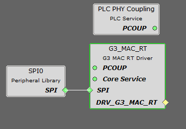

# Initialization

In the code of the example project `mac_rt_plc_and_go`, the initialization of the G3\_MAC\_RT module is performed during the first states of the state machine running in the PLC task `APP_PLC_Tasks()`.

**G3\_MAC\_RT Hardware Initialization**

The first states of the state machine configure and initialize different parts of the G3\_MAC\_RT hardware:

-   `APP_PLC_STATE_IDLE` initializes the variables related to the coupling stage.
-   `APP_PLC_STATE_INIT` opens the PLC driver to load the G3\_MAC\_RT binary.

The MACrt PLC & Go application loads by default the configuration to use the default coupling stage of the evaluation kit \(FCC + CENELEC-A Multiband for the PL460-EK\). If other coupling configuration is required, it can be easily modified in G3\_MAC\_RT module of the project graph in MPLAB Code Configurator:



**Callback setting**

The state `APP_PLC_STATE_OPEN` configures the PLC callbacks to manage the different events coming from the G3\_MAC\_RT, applies the initial configuration and enables the PVDD monitor, required to transmit with the G3\_MAC\_RT.

The callbacks to manage different events are:

-   Data\_indication event is managed by `APP_PLC_DataIndCb()` function to process all the PLC messages received.
-   Data\_confirm event is managed by `APP_PLC_DataCfmCb()` function to process the results of sending a PLC message.
-   Exception events are managed by `APP_PLC_ExceptionCb()` function.
-   PLC disable sleep mode event is managed by `APP_PLC_SleepModeDisableCb()` function to restart the configuration.
-   PVDD monitor events are managed by `APP_PLC_PVDDMonitorCb()` function

``` {#CODEBLOCK_QQS_PW4_BTB}
        case APP_PLC_STATE_OPEN:
        {
            /* Check PLC transceiver */
            if (DRV_G3_MACRT_Status(DRV_G3_MACRT_INDEX_0) == SYS_STATUS_READY)
            {
                /* Configure PLC callbacks */
                DRV_PLC_PHY_ExceptionCallbackRegister(appPlc.drvPl360Handle, APP_PLC_ExceptionCb);
                DRV_PLC_PHY_DataCfmCallbackRegister(appPlc.drvPl360Handle, APP_PLC_DataCfmCb);
                DRV_PLC_PHY_DataIndCallbackRegister(appPlc.drvPl360Handle, APP_PLC_DataIndCb);
                DRV_PLC_PHY_SleepDisableCallbackRegister(appPlc.drvPl360Handle, APP_PLC_SleepModeDisableCb);
                
                /* Apply PLC initial configuration */
                APP_PLC_SetInitialConfiguration();
                
                /* Enable PLC Transmission */
                DRV_G3_MACRT_EnableTX(appPlc.drvPl360Handle, true);
                
```

**G3\_MAC\_RT enabling**

When the callbacks are set, the G3\_MAC\_RT binary is already loaded from flash memory and its integrity is checked, but transmission is not allowed until the PVDD Monitor Service starts:

``` {#CODEBLOCK_JJZ_QW4_BTB}
       /* Enable PLC PVDD Monitor Service: ADC channel 0 */
                SRV_PVDDMON_RegisterCallback(APP_PLC_PVDDMonitorCb, 0);
                SRV_PVDDMON_Start(SRV_PVDDMON_CMP_MODE_OUT);

```

**Parent topic:**[Application Example](GUID-6A361F7F-55F2-4965-AED4-AEE549D5550F.md)

