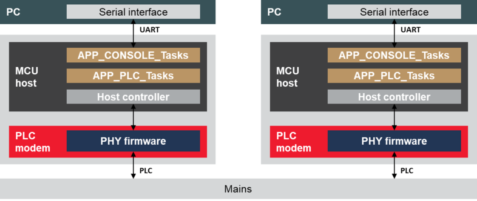

# Application Example

Microchip MACrt PLC & Go application is a point to point or multi-point chat application built on top of the MACrt layer Microchip implementation of G3-PLC protocol \(G3\_MAC\_RT module\).

Note that `mac_rt_plc_and_go` application example can be used with Microchip G3-PLC stack version included on MPLAB Harmony in any Microchip platforms implementing PL360/PL460 device as PLC modem.

This application example assumes that a host device \(a PC, for example\) is connected through a serial interface \(USB, UART\) to a Microchip evaluation kit acting as a PLC modem.

The figure below provides an example of the minimum hardware and firmware resources required to run MACrt PLC & Go.

The MACrt PLC & Go application interchanges data with the PC through a serial port using a terminal emulator \(see figure MACrt PLC & Go console where terminal emulator TeraTerm is used\). The settings of the serial port are: 921600 bps, 8 data bits, no parity, 1 stop bit and flow control.

When the serial port is opened, the MACrt PLC & Go application shows in the console some information about the hardware platform and the firmware running, and it waits for a message to be sent. The message is sent when a carriage return character is received or the maximum length of the PLC data message is reached. If the user sends the ASCII character 0x13 \(‘CTRL+S’\), a configuration menu is shown.

The MACrt PLC & Go application allows to:

-   Configure source/destination address
-   Configure the TX/RX channel
-   Configure the Ack Request Mechanism

In addition, the application provides some information about the transmitted messages \(length of the message\) and the received messages \(Modulation type and LQI\), which can be displayed by means of a terminal emulator in the PC.

In the example project, the `app_plc.c` file contains:

-   PLC initialization and configuration functions
-   Handlers for received messages, transmission and events

The `app_console.c` file contains the chat application which communicates with the PC using the serial port.

-   **[Initialization](GUID-369581E4-E1C7-4395-8F38-B175B9EAD9C1.md)**  

-   **[Transmission](GUID-452914FD-66E7-46B4-99B6-B1C1D15A3E4B.md)**  

-   **[Reception](GUID-BA1CD773-8303-4C77-B4C0-23BCD41231C5.md)**  

**Parent topic:**[MACrt PLC & Go](GUID-CE3EF484-E886-4378-90B5-20C2BC7A43D1.md)

